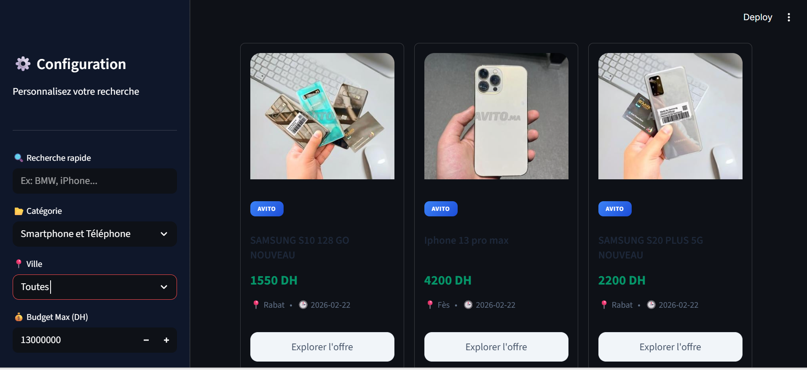
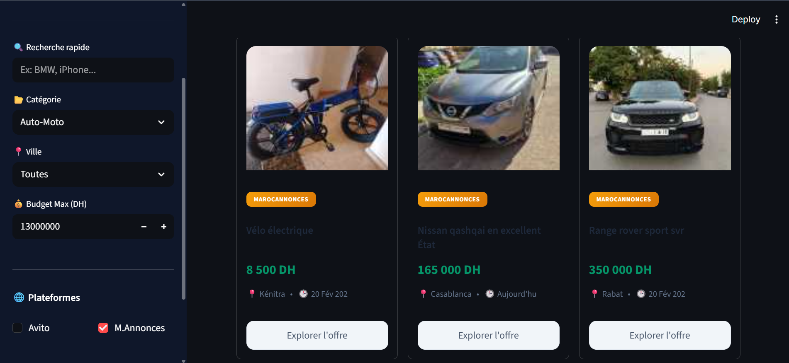

# 🛒 Projet Annonces


## 📋 Description

Application de collecte et de traitement d'annonces en temps réel provenant de plusieurs plateformes marocaines (Avito, MarocAnnonces).

Le système fonctionne selon cette architecture :
- **2 Producers** : Collectent les données via scraping et les envoient à Kafka
- **Kafka** : Broker de messages (topics dédiés par source)
- **2 Consumers Spark** : Traitent les flux en temps réel avec Apache Spark Streaming
- **Mysql**: base de données relationnelle pour le stockage des données nettoyées et transformées via Spark Streaming.
- **Interface Streamlit** : Permet aux utilisateurs de filtrer les offres selon leur budget, catégorie et ville



## 🏗️ Architecture


## 🚀 Technologies Utilisées

### Backend
- **Python 3.9+**
- **Apache Kafka** : Message broker
- **Apache Spark 3.5.0** : Stream processing
- **MySQL 8.0** : Base de données (Port 3307)
- **Requests + BeautifulSoup4** : Scraping

### Frontend
- **Streamlit** : Interface web
- **Pandas** : Manipulation de données

### Infrastructure
- **WSL Ubuntu** : Environnement de développement
  


## 📦 Prérequis

- Windows avec WSL Ubuntu
- Python 3.9 ou supérieur
- Java 11+ (pour Spark)
- MySQL Server (port 3307)
- Apache Kafka + Zookeeper
- Apache Spark 3.5.0
- Connexion Internet (pour le scraping)

## ⚙️ Installation

### 1. Créer un environnement virtuel

```bash
python -m venv venv
source venv/bin/activate  # WSL Ubuntu
```

### 2. Installer les dépendances

```bash
pip install -r requirements.txt
```

**Contenu de `requirements.txt` :**
```txt
streamlit==1.28.0
pandas==2.1.0
mysql-connector-python==8.1.0
kafka-python==2.0.2
requests==2.31.0
beautifulsoup4==4.12.2
plotly==5.17.0
pyspark==3.5.0
```

### 3. Configuration de la base de données

```bash
python initialiser_db.py
```

### 4. Créer les topics Kafka (WSL Ubuntu)

```bash
# Topic pour Avito
~/kafka/bin/kafka-topics.sh --create \
  --topic avito_listings \
  --bootstrap-server localhost:9092 \
  --partitions 3 \
  --replication-factor 1

# Topic pour MarocAnnonces
~/kafka/bin/kafka-topics.sh --create \
  --topic annonces-raw \
  --bootstrap-server localhost:9092 \
  --partitions 3 \
  --replication-factor 1
```

## 🎮 Utilisation

### Terminal 1 : Spark Job 1 (Avito)

```bash
cd ~/projet-annonces
source venv/bin/activate
python spark_job1.py
```

### Terminal 2 : Spark Job 2 (MarocAnnonces)

```bash
cd ~/projet-annonces
source venv/bin/activate
python spark_job2.py
```

### Terminal 3 : Interface Streamlit

```bash
cd ~/projet-annonces
source venv/bin/activate
streamlit run app.py
```

Interface accessible sur : `http://localhost:8501`

## 📧 Contact

**Email** : elmerahy.ensa@uhp.ac.ma
**Environnement** : WSL Ubuntu sur Windows


